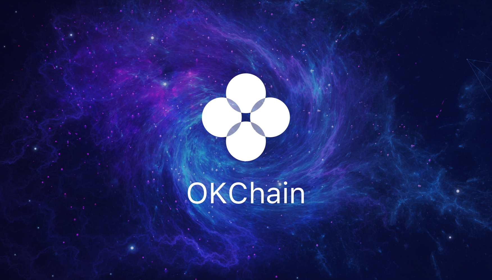

# OKChain
The Infrastructure of Decentralized Exchange



[](https://circleci.com/gh/okex/okchain/tree/master)
[](https://codecov.io/gh/okex/okchain)
[](https://goreportcard.com/report/github.com/okex/okchain)
[](https://github.com/okex/okchain/blob/master/LICENSE)
[](https://github.com/okex/okchain)
[](https://golangci.com/r/github.com/okex/okchain)

This repository hosts `OKChain`, the implementation of the OKChain based on the [Cosmos SDK](https://github.com/cosmos/cosmos-sdk).

**Note**: Requires [Go 1.12](https://golang.org/dl/)

## Getting Started
See the [documentation](https://okchain-docs.readthedocs.io/en/latest/index.html).

## OKChain Testnet

To run a full-node for the testnet of the OKChain, first [install `okchaind`](https://okchain-docs.readthedocs.io/en/latest/getting-start/install.html), then follow [the guide](https://okchain-docs.readthedocs.io/en/latest/getting-start/join_testnet.html).

For status updates and genesis file, see the [genesis](https://okchain-docs.readthedocs.io/en/latest/getting-start/join_testnet.html#genesis).

## Quick Start

```
make install
```


