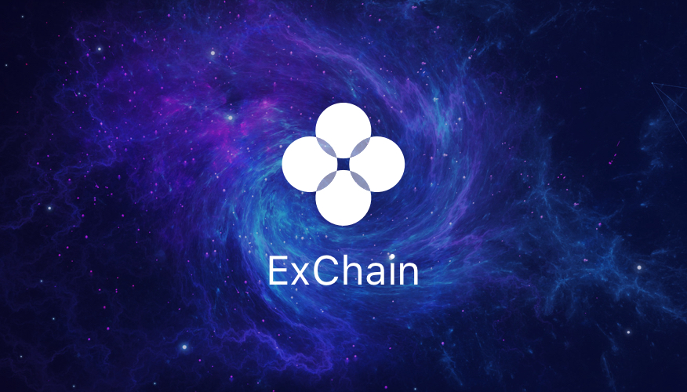

# OKExChain
The Infrastructure of Decentralized Exchange



[](https://github.com/okex/okexchain/releases/latest)
[](https://circleci.com/gh/okex/okexchain/tree/master)
[](https://codecov.io/gh/okex/okexchain)
[](https://goreportcard.com/report/github.com/okex/okexchain)
[](https://github.com/okex/okexchain/blob/master/LICENSE)
[](https://github.com/okex/okexchain)
[](https://golangci.com/r/github.com/okex/okexchain)

This repository hosts `OKExChain`, the implementation of the OKExChain based on the [Cosmos SDK](https://github.com/cosmos/cosmos-sdk).

**Note**: Requires [Go 1.12](https://golang.org/dl/)

## Getting Started
See the [documentation](https://okchain-docs.readthedocs.io/en/latest/index.html).

## OKExChain Testnet

To run a full-node for the testnet of the OKExChain, first [install `okchaind`](https://okchain-docs.readthedocs.io/en/latest/getting-start/install-okchain.html), then follow [the guide](https://okchain-docs.readthedocs.io/en/latest/getting-start/join-okchain-testnet.html).

For status updates and genesis file, see the [genesis](https://okchain-docs.readthedocs.io/en/latest/getting-start/join-okchain-testnet.html#genesis-seeds).

## Quick Start

```
make install
```


